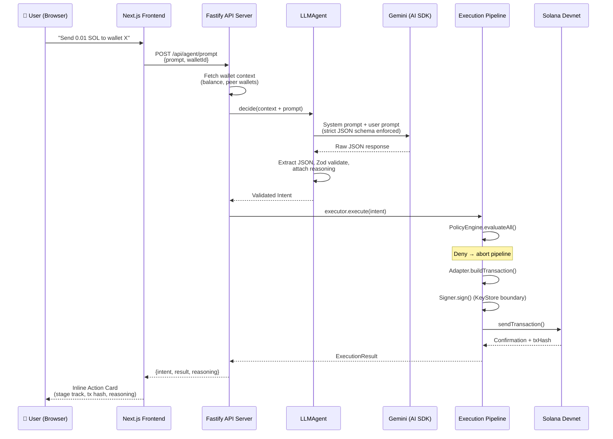

# Large Language Model (LLM) Integration

Agentic Wallet provides a first-class AI integration layer that converts plain-English prompts into validated, policy-checked on-chain transactions — without the model ever touching private keys.

[](https://youtu.be/EWCTTyLtFvE)

## How It Works

A user types a natural-language request (e.g. *"Send 0.01 SOL to wallet X"*). The system interprets, validates, and executes it through a strict pipeline:

1. The **Next.js frontend** sends the prompt and the selected wallet ID to the **Fastify API server**.
2. The server assembles wallet context (balance, peer wallets) and passes everything to the **LLMAgent**.
3. The **LLMAgent** enriches the prompt with wallet context and a strict JSON schema, then calls **Google Gemini** (or any configured provider) via the **Vercel AI SDK**.
4. The model responds with a raw JSON intent. The agent extracts, parses, and **validates it with Zod** — halting immediately if the output is malformed.
5. The validated `Intent` enters the **Execution Pipeline**: policy checks → transaction building → signing → RPC submission → on-chain confirmation.
6. The result (tx hash or error) flows back through the API to the frontend, where an **inline action card** visualises each pipeline stage in real time.

### End-to-End Flow Diagram



## Architecture Details

### 1. Provider-Agnostic AI Client (`AIClient`)

The `AIClient` wraps the Vercel AI SDK (`ai` package) to provide a generic, extensible interface for querying language models. Swapping providers requires changing a single line — no agent or pipeline code is affected.

| Aspect | Detail |
|---|---|
| **Default provider** | Google Gemini (`gemini-2.5-flash`) via `@ai-sdk/google` |
| **Extensibility** | Add a branch in `resolveModel()` for `@ai-sdk/openai`, `@ai-sdk/anthropic`, or local models |
| **Configuration** | `AIClientOptions { provider, model }` — settable per-request or via `GEMINI_MODEL` env var |

### 2. The `LLMAgent`

The `LLMAgent` extends the core `BaseAgent`. Unlike programmatic strategies (arbitrage bots, rebalancers), it relies entirely on the AI model to interpret user intent.

**How the agent decides:**

1. **Context assembly** — Receives the wallet's public key, on-chain SOL balance, and a list of peer wallets so the model knows what resources exist.
2. **Prompt construction** — Combines a strict system prompt (defining all valid intent JSON schemas) with the user's natural language request.
3. **Model call** — Sends the combined prompt to the configured AI provider and receives raw text.
4. **Extraction & validation** — Regex-extracts JSON from the response, parses it, and runs it through the Zod `IntentSchema`. Malformed output throws instantly — no keys are ever fetched.
5. **Reasoning capture** — Extracts the model's `reasoning` string for transparent audit logging before the intent enters the execution pipeline.

### 3. API Bridge & Frontend UI

#### Fastify API Server (`src/server/`)

The server is the conduit between the browser and the wallet kernel. It exposes two routes:

| Route | Method | Purpose |
|---|---|---|
| `/api/wallets` | GET | Returns all wallet IDs, public keys, balances, and any RPC errors |
| `/api/agent/prompt` | POST | Accepts `{prompt, walletId}`, runs LLMAgent → Executor, returns intent + result + reasoning |

Both routes instantiate kernel components at startup (WalletManager, Executor, SolanaClient) and reuse them across requests.

#### Next.js Frontend UI (`frontend/`)

A responsive, cyberpunk-themed interface optimised for both mobile and desktop.

| Component | What it does |
|---|---|
| **AgentChat** | Chat interface where users converse with the LLMAgent. Each prompt/response pair is displayed with an inline action card showing the full pipeline lifecycle |
| **Inline Action Cards** | Embedded below each agent response — shows stage track (`Think` → `Validate` → `Policy` → `Build` → `Sign` → `Send` → `Confirm`), reasoning, tx hash with Solscan link, or error details. Collapsible JSON view for the raw intent |
| **WalletPanel** | Sidebar listing all simulation wallets with balances. Supports hot-swapping between wallets without losing chat history |

## Security Guarantees

Integrating AI directly with private keys requires zero trust out of the box.

* **No Raw Payloads**: The LLM *never* constructs instructions, transactions, or bytecode. It *only* outputs a predefined Intent standard.
* **Total Key Segregation**: The `LLMAgent` has no access to the `KeyStore`. It merely passes its Intent to the centralized `Executor`, which enforces `PolicyEngine` checks before the `Signer` retrieves keys.
* **Bounded Scope**: Regardless of the prompt (even explicit jailbreaks), if the output Intent violates `RateLimitPolicy` or `MaxSpendPolicy`, execution drops.

## Environment Variables required for LLM functionality

If using the default Google provider:

```bash
GOOGLE_GENERATIVE_AI_API_KEY=your-api-key-here
# Optional configuration
GEMINI_MODEL=gemini-2.0-flash 
```

## Running the Interface

To experience the AI integration firsthand, ensure your environment variables are set up and run:

```bash
npm run dev
```

This spins up the stack simultaneously:

* **Backend**: The `src/server/index.ts` API bridge starts on port `:3001`.
* **Frontend**: The `frontend/` Next.js application starts on port `:3000`.

Visit **<http://localhost:3000>** to select a wallet and direct the agent using plain English!
